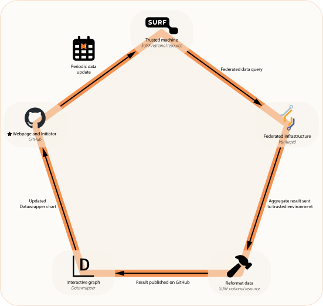

# STRONG AYA Information Portal
This repository contains the code for the basic version for the STRONG AYA information portal.  
The portal was designed in Adobe XD, and here is embedded in a GitHub pages application as a **proof of concept** 
that allows users to inspect data from multiple sources in a single interface.  
The repository has a Vantage6 integration
that attempts to retrieve the data from the STRONG AYA Vantage6 infrastructure.  
This integration is triggered through a GitHub workflow and will periodically repeat the task after a set interval.  
The proof of concept application is available at https://strongaya.github.io/strong-aya-info-portal/.

The full design of the portal is showcased in the `STRONG-AYA-Cancer-Info-Portal-Design.mp4` file
and is embedded below.

https://github.com/user-attachments/assets/154512a6-c9a5-49f8-bd9a-08ee88ba29f3

The portal is built using Adobe XD, Locofy.ai, GitHub Pages, Datawrapper and Vantage6.  
A schematic overview can be found in the `STRONG-AYA-Info-Portal-PoC-Flow.svg` file and is embedded below.

The provided implementation has a large dependency on the descriptive statistics algorithm,
please refer to its respective repository for more information
(https://github.com/STRONGAYA/v6-descriptive-statistics).

A more extensive description of the methodology that this repository represents 
can be found in the associated scientific publication: currently as preprint on ...TODO_PAPER...

## Prequisites for own application
- ### When using the descriptive statistics algorithm (default)
  - Vantage6 server and collaboration with nodes running on version 4.x.x
  - Distributed data in RDF-triple format 
  (produced using the Triplifier tool e.g. through https://github.com/MaastrichtU-CDS/Flyover)
  - Annotated data using the SIO's has-attribute relation 
  (http://semanticscience.org/resource/SIO_000008)
  - GraphDB instances running and accessible on distributed data stations
  - Credentials to send a task to the Vantage6 server stored as GitHub secrets
- ### In development mode
  - Python 3.10 environment with libraries in `requirements.txt` installed
  - Access to example data in `example_data/` or alternative data in the same format

## References and acknowledgements
- Icons present in this repository were obtained through FontAwesome.
- Images present in this repository were generated using Adobe Firefly generative artificial intelligence.
- Datawrapper people chart implementation was guided by the very helpful Datawrapper support staff ❤️. 
