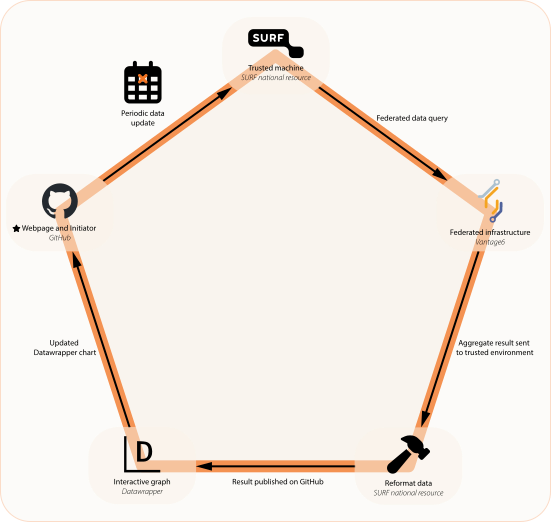

# STRONG AYA Information Portal
This repository contains the code for the basic version for the STRONG AYA information portal.  
The portal was designed in Adobe XD, and here is embedded in a GitHub pages application as a **proof of concept** 
that allows users to inspect data from multiple sources in a single interface.  
The repository has a Vantage6 integration
that attempts to retrieve the data from the STRONG AYA Vantage6 infrastructure.  
This integration is triggered through a GitHub workflow and will periodically repeat the task after a set interval.  
The proof of concept application is available at https://strongaya.github.io/strong-aya-info-portal/.

The full design of the portal is showcased in the `STRONG-AYA-Cancer-Info-Portal-Design.mp4` file
and is embedded below.

https://github.com/user-attachments/assets/154512a6-c9a5-49f8-bd9a-08ee88ba29f3

The portal is built using Adobe XD, Locofy.ai, GitHub Pages and Vantage6.  
A schematic overview can be found in the `STRONG-AYA-Info-Portal-PoC-Flow.svg` file and is embedded below.


The provided implementation has a large dependency on the descriptive statistics algorithm,
please refer to its respective repository for more information
(https://github.com/STRONGAYA/v6-descriptive-statistics).

A more extensive description of the methodology that this repository represents 
can be found in the associated scientific publication: currently as preprint on ...TODO_PAPER...

## Data
Every topic page reads one small CSV with the number of people per category from `web/data/<variable>.csv`, e.g.
`web/data/ther_chemo.csv`:

```csv
category,count
received,1830
notReceived,1470
```

The counts are plain numbers of people (they do not have to add up to 100); the website scales them to
"out of 100 people" itself. The category names are the legend ids defined for the page in
`web/js/visualisation.js`. To replace the numbers shown on a page, edit or overwrite its CSV.

The treatment CSVs are regenerated by the `Update data through Vantage6 integration` workflow:
`scripts/vantage6_integration.py` stores the federated result in `data/raw/vantage6_result.json` and
`scripts/construct_counts.py` sums it into the categories listed in `data/variables.json`
(variable → category → raw values). The other CSVs are maintained by hand until the federated
analysis provides those variables as well.

The EORTC QLQ-AYA pages (e.g. `web/data/qlq_aya_sex_life.csv`) count people per answer: `notAtAll`, `aLittle`,
`quiteABit` and `veryMuch`, as the questions ask whether a part of life has been negatively affected. The answers
are scored like the EORTC QLQ-C30 (0–100, higher is more affected): a single question (romantic life, sex life) scores
0, 33, 67 or 100, and a scale (relationships, self-esteem) falls in the range of the nearest answer (0, up to 33,
up to 67, above 67). "Affected a lot" is quite a bit or very much. The QLQ-AYA has no published thresholds for
clinical importance yet: its international validation study runs until 2029.

### Articles from beatcancer.eu
The bottom of every topic page points to support and shows a few articles about the topic from
[beatcancer.eu](https://beatcancer.eu/resources/), the website of the European Youth Cancer Network (YARN);
they open in a new tab. That website has no API and cannot be embedded, so
`scripts/fetch_beatcancer_resources.py` reads its resource listing and writes the articles per page to
`web/data/beatcancer_resources.json`. The `Update beatcancer.eu resources` workflow does this every Monday and
redeploys the site when the articles changed; run it by hand from the Actions tab (or run the script locally) to
refresh them sooner:

```shell
python scripts/fetch_beatcancer_resources.py data/beatcancer_topics.json web/data/beatcancer_resources.json
```

Which articles a page shows is set in `data/beatcancer_topics.json`. Per page (the file name of the topic page):
- `topics`: the beatcancer.eu topics (as named in its topic filter) the page links to, and takes articles from
  when the keywords do not fill all places;
- `keywords`: groups of whole words or phrases; articles with a word of the first group in their title come first,
  then those of the next group, and so on (the newest first).

`exclude_types` and `exclude_title_words` skip articles that do not suit the pages (e.g. research papers, or
articles for caregivers or about the end of life), and `resources_per_page` sets the number of articles.

## Prequisites for own application
- ### When using the descriptive statistics algorithm (default)
  - Vantage6 server and collaboration with nodes running on version 4.x.x
  - Distributed data in RDF-triple format 
  (produced using the Triplifier tool e.g. through https://github.com/MaastrichtU-CDS/Flyover)
  - Annotated data using the SIO's has-attribute relation 
  (http://semanticscience.org/resource/SIO_000008)
  - GraphDB instances running and accessible on distributed data stations
  - Credentials to send a task to the Vantage6 server stored as GitHub secrets
- ### In development mode
  - Python 3.10 environment with libraries in `requirements.txt` installed
  - Access to example data in `example_data/` or alternative data in the same format

## References and acknowledgements
- Icons present in this repository were obtained through FontAwesome.
- Images present in this repository were generated using Adobe Firefly generative artificial intelligence.
